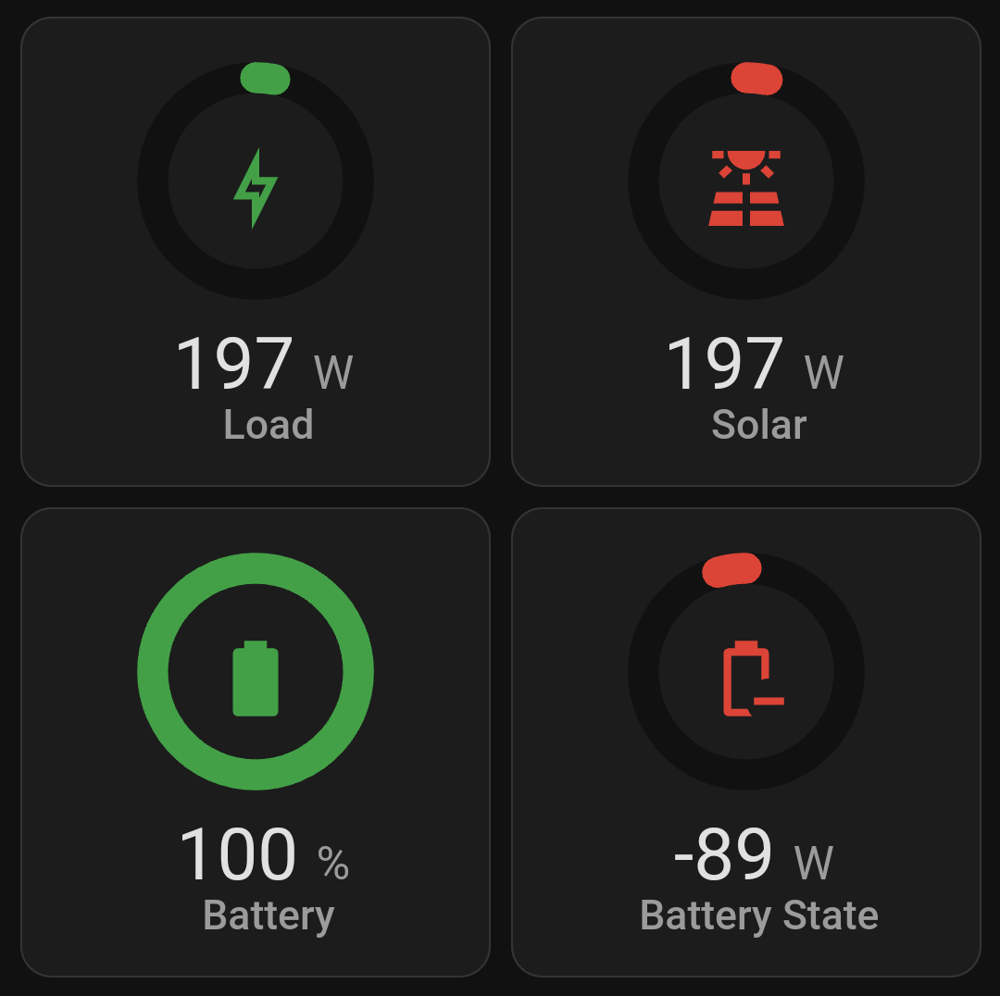

# Engauge

[![GitHub Release][releases-shield]][releases]
[![License][license-shield]](LICENSE)
[![Build][build-shield]][build]

Enguage is a circular gauge with icon card. The goal is to be a (almost) hot replacement for the build in gauge but with extra options and an icon.

## Installation

Add this custom repository in HACS and install.

### Preview

## Options

| Name                | Type    | Requirement  | Description                                                   | Default                         |
| ------------------- | ------- | ------------ | ------------------------------------------------------------- | ------------------------------- |
| `type`              | string  | **Required** | `custom:engauge-card`                                         |                                 |
| `entity`            | string  | **Required** | entity_id                                                     |                                 |
| `name`              | string  | **Optional** | Name                                                          | From Entity                     |
| `horizontal`        | boolean | **Optional** | Horizontal layout                                             | false                           |
| `unit`              | string  | **Optional** | The unit of measure                                           | From Entity                     |
| `icon`              | string  | **Optional** | mdi:icon                                                      | From Entity                     |
| `iconColor`         | string  | **Optional** | Icon color. Severity or segment will override this            |                                 |
| `iconSize`          | number  | **Optional** | Icon size                                                     | 35                              |
| `min`               | number  | **Optional** | Minimum gauge value                                           | 0                               |
| `max`               | number  | **Optional** | Maximum gauge value                                           | 100                             |
| `size`              | number  | **Optional** | Size of gauge                                                 | 100                             |
| `dialColor`         | string  | **Optional** | Color of dial                                                 | var(--primary-background-color) |
| `dialWidth`         | number  | **Optional** | Stroke width of dial                                          | 12                              |
| `valueColor`        | string  | **Optional** | Color of value                                                | var(--primary-color)            |
| `valueWidth`        | number  | **Optional** | Stroke width of value                                         | 12                              |
| `backgroundColor`   | string  | **Optional** | Background Color                                              | none                            |
| `backgroundRadius`  | number  | **Optional** | Background Radius                                             | 40                              |
| `startAngle`        | number  | **Optional** | Start Angle                                                   | 270                             |
| `animationDuration` | number  | **Optional** | Animation Time                                                | 0.7                             |
| `rounded`           | boolean | **Optional** | Strike Cap Rounded                                            | true                            |
| `hideText`          | boolean | **Optional** | Hide all text                                                 | false                           |
| `primaryFontSize`   | number  | **Optional** | Font Size in pixels for primary text                          | 14                              |
| `secondaryFontSize` | number  | **Optional** | Font Size in pixels for secondary text                        | 12                              |
| `unitFontSize`      | number  | **Optional** | Font Size in pixels for unit                                  | 12                              |
| `severity`          | map     | **Optional** | Allows setting of colors for different numbers.               |                                 |
| `segments`          | list    | **Optional** | List of colors and start values. Segments will override this. |                                 |

### Severity

| Name         | Type   | Requirement  | Description                                |
| ------------ | ------ | ------------ | ------------------------------------------ |
| `green`      | number | **Optional** | Value from which to start green color      |
| `yellow`     | number | **Optional** | Value from which to start yellow color     |
| `red`        | number | **Optional** | Value from which to start red color        |
| `pink`       | number | **Optional** | Value from which to start pink color       |
| `purple`     | number | **Optional** | Value from which to start purple color     |
| `deepPurple` | number | **Optional** | Value from which to start deepPurple color |
| `indigo`     | number | **Optional** | Value from which to start indigo color     |
| `blue`       | number | **Optional** | Value from which to start blue color       |
| `lightBlue`  | number | **Optional** | Value from which to start lightBlue color  |
| `cyan`       | number | **Optional** | Value from which to start cyan color       |
| `teal`       | number | **Optional** | Value from which to start teal color       |
| `lightGreen` | number | **Optional** | Value from which to start lightGreen color |
| `lime`       | number | **Optional** | Value from which to start lime color       |
| `amber`      | number | **Optional** | Value from which to start amber color      |
| `orange`     | number | **Optional** | Value from which to start orange color     |
| `deepOrange` | number | **Optional** | Value from which to start deepOrange color |
| `brown`      | number | **Optional** | Value from which to start brown color      |
| `grey`       | number | **Optional** | Value from which to start grey color       |
| `blueGrey`   | number | **Optional** | Value from which to start blueGrey color   |
| `black`      | number | **Optional** | Value from which to start black color      |
| `white`      | number | **Optional** | Value from which to start white color      |
| `disabled`   | number | **Optional** | Value from which to start disabled color   |

### Segments

| Name              | Type   | Requirement  | Description                         |
| ----------------- | ------ | ------------ | ----------------------------------- |
| `from`            | number | **Required** | Value from which to start the color |
| `dialColor`       | number | **Optional** | Color of dial                       |
| `valueColor`      | number | **Optional** | Color of value                      |
| `backgroundColor` | number | **Optional** | Background Color                    |
| `icon`            | number | **Optional** | mdi:icon                            |
| `iconColor`       | number | **Optional** | Icon color                          |

## Examples

- [Default With Icon](examples/DefaultWithIcon.yaml)
- [Horizontal Battery](examples/HorizontalBattery.yaml)
- [No Background](examples/NoBackground.yaml)
- [Not Rounded](examples/NotRounded.yaml)
- [Segments Custom Icon](examples/SegmentsCustomIcon.yaml)
- [Severity](examples/Severity.yaml)
- [Small Start Angle](examples/SmallStartAngle.yaml)
- [Value Width](examples/ValueWidth.yaml)
- [Width](examples/Width.yaml)

## Notes

- There is currently no editor UI to change config and no current plans on adding it.

[releases-shield]: https://img.shields.io/github/v/release/jacokok/engauge.svg?style=for-the-badge
[releases]: https://github.com/jacokok/engauge/releases
[license]: https://img.shields.io/github/license/jacokok/engauge.svg?style=for-the-badge
[license-shield]: https://img.shields.io/github/license/jacokok/engauge.svg?style=for-the-badge
[build]: https://github.com/jacokok/engauge/actions/workflows/build.yml
[build-shield]: https://img.shields.io/github/actions/workflow/status/jacokok/engauge/build.yml?branch=main&style=for-the-badge
