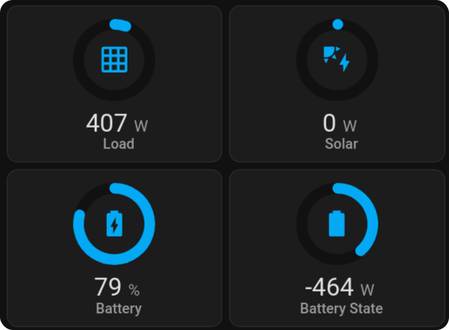

# Engauge

Enguage is an icon gauge card. It is like a entity and gauge card in one.

## Installation

### HACS

Mushroom is available in [HACS][hacs] (Home Assistant Community Store).

1. Install HACS if you don't have it already
2. Open HACS in Home Assistant
3. Go to "Frontend" section
4. Click button with "+" icon
5. Search for "Mushroom"

### Preview

## Options

| Name         | Type    | Requirement  | Description                                                                                        | Default     |
| ------------ | ------- | ------------ | -------------------------------------------------------------------------------------------------- | ----------- |
| `type`       | string  | **Required** | `custom:engauge-card`                                                                              |             |
| `entity`     | string  | **Required** | entity_id                                                                                          |             |
| `name`       | string  | **Optional** | Name                                                                                               | From Entity |
| `horizontal` | boolean | **Optional** | Horizontal layout                                                                                  | false       |
| `unit`       | string  | **Optional** | The unit of measure                                                                                | From Entity |
| `icon`       | string  | **Optional** | mdi:icon                                                                                           | From Entity |
| `iconColor`  | string  | **Optional** | Icon color. Severity or segment will override this                                                 |             |
| `iconSize`   | number  | **Optional** | Icon size                                                                                          |             |
| `min`        | number  | **Optional** | Minimum gauge value                                                                                | 0           |
| `max`        | number  | **Optional** | Maximum gauge value                                                                                | 100         |
| `size`       | number  | **Optional** | Size of gauge                                                                                      | 100         |
| `severity`   | map     | **Optional** | Allows setting of colors for different numbers.                                                    |             |
| `segments`   | list    | **Optional** | List of colors and their corresponding start values. Segments will override the severity settings. |             |

## Todo

- [x] Update animation from javascript to css
- [ ] Test all options
- [ ] Document all options
- [ ] Create Editor
- [ ] Color animations
- [ ] Color overrides for icon and rest based on severity and segments.
- [ ] Add eslint
- [x] Add husky
- [x] Fix all hacs issues github action
